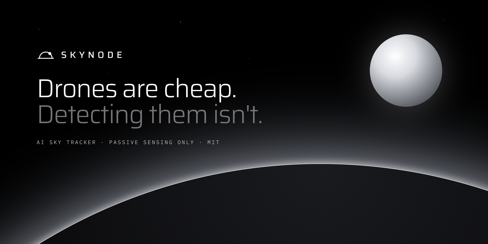
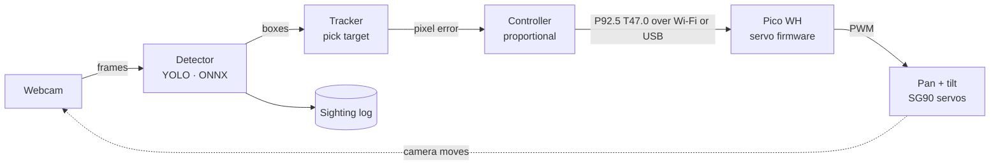
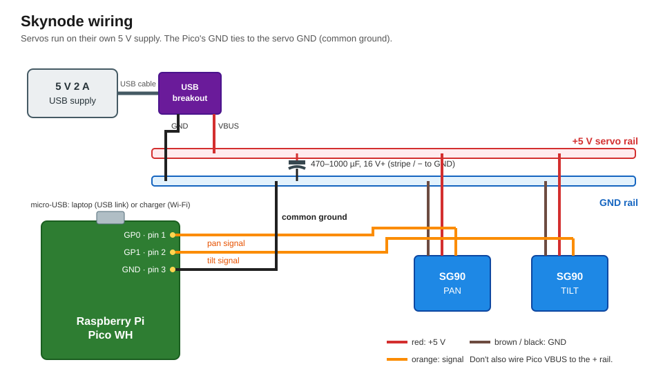
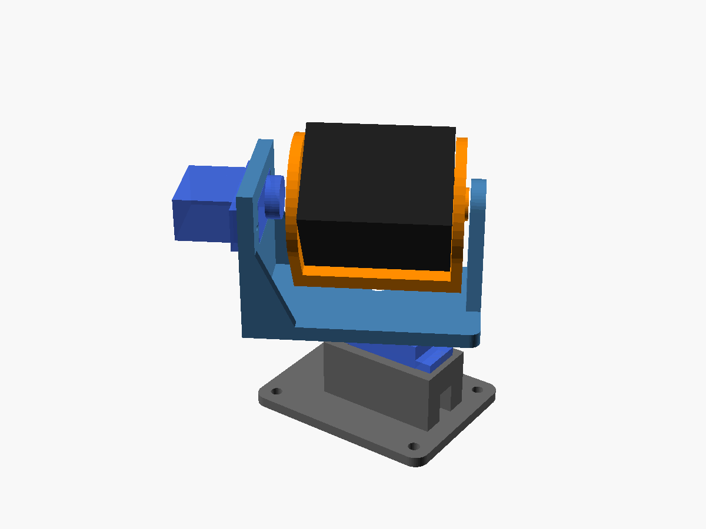
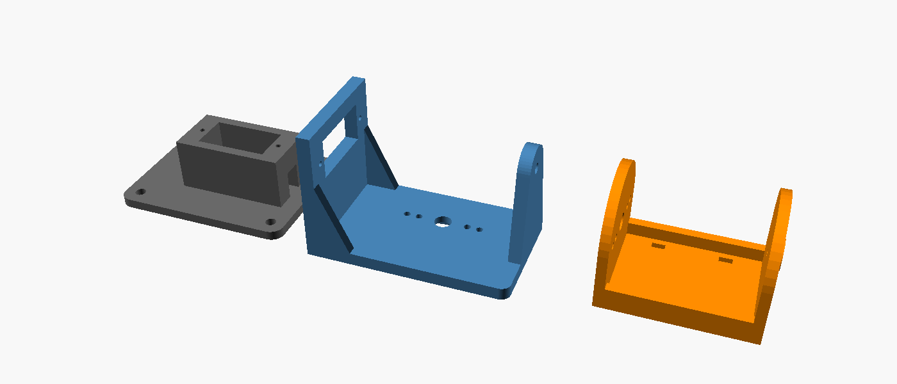

<p align="center"></p>

# Skynode

[](https://skynode-si.netlify.app) [](https://app.netlify.com/projects/skynode-si/deploys)

**Website: [skynode-si.netlify.app](https://skynode-si.netlify.app)** (source in [`web/`](web/))

AI sky tracker: a YOLO model detects aircraft and drones, a Pico-driven pan-tilt camera follows them, and every sighting will be logged.

Skynode is layer one of a larger project: sense and track, built toward drone and aerospace systems.

> **Scope:** passive sensing and tracking only. No payloads, no effectors, and nothing that interacts with or interferes with aircraft.
> No jamming, no spoofing, and no transmitting on aviation or drone-control frequencies. Ordinary Wi-Fi and USB networking between Skynode's own parts is fine.

## How it works



1. **Sense.** The brain (a laptop for now, a Raspberry Pi 4 later) grabs webcam frames and runs a YOLO model through ONNX Runtime. For now that's the pretrained COCO YOLOv8n, tracking `airplane` and `bird`. A custom drone model can be swapped in through the config file.
2. **Track.** It picks one target and measures how far the target sits from the center of the frame, in pixels.
3. **Control.** A proportional controller turns that pixel error into a small pan/tilt correction ("the target is 40 px right, so pan +2°").
4. **Actuate.** The brain sends a plain-text command like `P92.5 T47.0` to the Pico over Wi-Fi (UDP) or USB serial. The Pico moves both servos smoothly, keeps them inside safe angle limits, and the camera re-centers on the target.
5. **Log.** Every sighting will be recorded with time, class, confidence, and pan/tilt angle. The logger isn't written yet (see [Roadmap](#roadmap)).

Detection, tracking, and control are separate modules, so each layer can be reused on future platforms.

## Repo layout

```
skynode/
├── pico/       MicroPython servo firmware (runs on the Pico WH)
├── brain/      detection, tracking, control, logging (runs on laptop / Pi 4)
├── docs/       wiring diagrams, photos, demo GIFs
├── hardware/   3D-print files for the pan-tilt bracket
└── tests/      laptop-side tests: python -m unittest discover tests
```

## Model

Model files are **not** in git (`*.onnx` and `*.pt` are gitignored).

- **Now:** the pretrained COCO **YOLOv8n**, exported to ONNX. It detects `airplane` and `bird` (small drones often show up as birds). See [Get a model](brain/README.md#get-a-model) for the one-time export.
- **Custom:** the five-class aircraft and drone model described in [Model training](#model-training). The model path and target classes are settings in `brain/config.toml`, so it drops in without code changes. Finished models go on [GitHub Releases](https://github.com/bsalsa2/Skynode/releases).

## Model training


Training results for **YOLOv8n** on a **28,526-image** aircraft and drone dataset with five classes: `civilian aircraft`, `fixed wing uav`, `military aircraft`, `military helicopter`, `multi-rotor`. The plot is Ultralytics' standard `results.png`: training and validation losses, precision, recall, mAP50, and mAP50-95 per epoch.

To track these classes, point `[model] path` in `brain/config.toml` at the exported `.onnx` and set `target_classes` to the names above.

The project is moving from these five classes to two: `drone` and `aircraft` (see v3 below).

### Results so far

- **v2** was tested on **43 real-world videos** of planes, military jets, and drones.
- On real aircraft, v2 wrongly called **7.5%** of frames a drone (**798 of 10,657** frames): **0.8%** for civilian planes and **10.8%** for military jets (mostly distant F-35s).
- **v3** is in training: classes merged to `drone` and `aircraft`, **960 px** input, resumed from v2.
- **Next:** score v3 against the same 43 clips.

## Bill of materials

Also in [`bom.csv`](bom.csv). Costs are rough USD estimates for the whole line (both servos in the servo row), before shipping.

| Part | Qty | Purpose | Est. cost | Link |
|---|---|---|---|---|
| Raspberry Pi Pico WH | 1 | Servo controller + Wi-Fi link (already owned) | owned | [link](https://www.raspberrypi.com/products/raspberry-pi-pico/) |
| Breadboard | 1 | Power rails and signal wiring (already owned) | owned |  |
| SG90 micro servo (or SG92R) | 2 | Pan and tilt axes | $11.90 | [link](https://www.adafruit.com/product/169) |
| SG90 pan-tilt bracket (or print hardware/pantilt.scad) | 1 | Holds both servos and the camera | $8.95 | [link](https://www.adafruit.com/product/1968) |
| 1080p USB webcam | 1 | The camera that watches the sky | $70.00 | [link](https://www.logitech.com/en-us/shop/p/c920s-pro-hd-webcam) |
| 5V 2A USB power supply | 1 | Dedicated servo power | $7.95 | [link](https://www.adafruit.com/product/1994) |
| USB breakout board | 1 | Brings the supply's 5V and GND onto the breadboard rails | $1.50 | [link](https://www.adafruit.com/product/1833) |
| 470-1000uF 16V+ electrolytic capacitor | 1 | Absorbs servo current spikes across the servo power rails | $0.95 | [link](https://www.sparkfun.com/electrolytic-decoupling-capacitors-1000uf-25v.html) |
| Jumper wires (male/male) | 1 | Breadboard and servo connections | $3.95 | [link](https://www.adafruit.com/product/758) |
| M2/M3 screw assortment | 1 | Servo tabs and horns (M2) and tilt pivot + base mounting (M3) | $8.00 |  |
| **Total to buy** | | | **$113.20** | |

The total covers the camera, servos, mount, power and wiring. It doesn't include the Pico WH and breadboard (already owned) or the computer that runs the model (a laptop now, a Raspberry Pi 4 later).

The servo link is Adafruit's SG92R, a drop-in SG90 equivalent. The webcam link is a full-size C920s; for the printed mount, a smaller 1080p webcam or camera board is lighter on the servos. Set its size in `hardware/pantilt.scad`.

## Wiring



SG90 wire colors: **brown = GND**, **red = +5 V**, **orange = signal**.

| From | To |
|---|---|
| 5 V 2 A supply → USB breakout VBUS | breadboard + rail |
| USB breakout GND | breadboard − rail |
| Both servo reds | + rail |
| Both servo browns | − rail |
| Pan servo orange | Pico pin 1 (GP0) |
| Tilt servo orange | Pico pin 2 (GP1) |
| Pico pin 3 (GND) | − rail (common ground) |
| 470–1000 µF capacitor | across + and − rails, stripe to − |
| Pico micro-USB | laptop (USB link) or any phone charger (Wi-Fi link) |

**Power notes**

- The servos get their own 5 V 2 A supply, so a stalling servo can't brown out the Pico. Don't also connect Pico VBUS (pin 40) to the + rail, or two supplies will fight.
- The common ground wire is required: servo signals are measured against GND, so the Pico and the servo supply must share it.
- Bench shortcut with no separate supply: wire Pico VBUS (pin 40) to the + rail instead of the breakout. A laptop port gives only about 500 mA, and two servos at their end stops can reset the Pico.
- One plug for Wi-Fi mode: the Pico W datasheet's *Powering* section shows how to feed VSYS (pin 39) from the same 5 V through a Schottky diode.

## Pan-tilt mount



[`hardware/pantilt.py`](hardware/pantilt.py) is a parametric CadQuery design: servo size, horn, webcam size, and wall thickness are parameters at the top of the file. Each part has an editable STEP file and a print-ready STL. It prints as three parts without supports:



| File | Part |
|---|---|
| [`pantilt_base.step`](hardware/pantilt_base.step) · [`.stl`](hardware/pantilt_base.stl) | Holds the pan servo; screws down with 4× M3 |
| [`pantilt_yoke.step`](hardware/pantilt_yoke.step) · [`.stl`](hardware/pantilt_yoke.stl) | Sits on the pan horn; holds the tilt servo and the M3 pivot |
| [`pantilt_camera_arm.step`](hardware/pantilt_camera_arm.step) · [`.stl`](hardware/pantilt_camera_arm.stl) | Webcam cradle on the tilt horn; camera held with two zip ties |

No custom PCB: the prototype is breadboard-wired (see wiring diagram). Build photos will be added when parts arrive.

Measure your servo and camera and adjust the parameters before printing. See [`hardware/README.md`](hardware/README.md).

## Getting started

1. **Pico firmware:** flash, test, and calibrate the servos. See [`pico/README.md`](pico/README.md).
2. **Brain:** install, export a model, and run detection with just the webcam. Then connect the Pico over Wi-Fi or USB. See [`brain/README.md`](brain/README.md).

## Roadmap

The website's Status section lists these same items. Update both together.

- [x] Pico servo firmware: smooth motion, calibration, command protocol
- [x] Detection + tracking loop, working in simulation, 70 automated tests
- [x] Pan-tilt mount designed in CAD, with STEP and STL files
- [x] Wiring diagram and bill of materials
- [ ] Detection model training: v3 with drone and aircraft classes (in progress)
- [ ] Build the physical hardware. Nothing has run on real hardware yet.
- [ ] Sighting logger
- [ ] Live dashboard
- [ ] Test against real flight data (ADS-B) and publish accuracy results
- [ ] Pi 4 + solar deployment

## Build photos

Photos coming soon. They'll go in [`docs/media/`](docs/media/).

## License

MIT, see [LICENSE](LICENSE).
