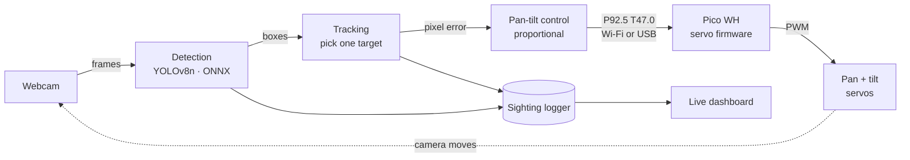

<p align="center"></p>

# Skynode

[](https://github.com/bsalsa2/Skynode/actions/workflows/tests.yml) [](LICENSE) [](https://skynode-si.netlify.app)

**Website: [skynode-si.netlify.app](https://skynode-si.netlify.app)** (source in [`web/`](web/))

**A low-cost visual sensing platform, starting with one passive sky-tracking node.**

A webcam on a pan-tilt mount watches the sky, a YOLO model finds aircraft and birds in each frame, the mount turns to follow the target, and every sighting is logged. This is Phase 1: one node, mostly tested in simulation so far. The physical unit is not built yet.

> **Scope:** passive sensing and tracking only. No payloads, no effectors, and nothing that interacts with or interferes with aircraft. No jamming, no spoofing, and no transmitting on aviation or drone-control frequencies. Ordinary Wi-Fi and USB networking between Skynode's own parts is fine.

## Status

| Part | Status | Notes |
|---|---|---|
| Pico servo firmware (smooth motion, calibration, command protocol) | Tested in software | Not yet run on the physical servos |
| Detection and tracking loop | Simulated | Runs on recorded video and a webcam; covered by the test suite |
| Pan-tilt control | Simulated | Sends commands to the Pico over Wi-Fi or USB |
| Sighting logger | Simulated | Built and tested; not yet run on the real hardware |
| Live dashboard | Simulated | Built and tested; not yet run on the real hardware |
| Pan-tilt mount (CAD) | Designed | STEP and STL files included; not printed |
| Wiring and bill of materials | Designed | Breadboard prototype plan; not wired |
| Detection model v2 | Tested on video | 43 real-world clips (see Results) |
| Detection model v3 (drone and aircraft classes) | In training | Not yet scored |
| Physical build | **Not built yet** | Nothing has run on real hardware |
| Accuracy against ADS-B flight data | **Not built yet** | |

## How it works



1. **Detection.** The brain (a laptop for now, a Raspberry Pi 4 later) grabs webcam frames and runs a YOLO model through ONNX Runtime. For now that's the pretrained COCO YOLOv8n, tracking `airplane` and `bird`. A custom model can be swapped in through the config file.
2. **Tracking.** It picks one target and measures how far that target sits from the center of the frame, in pixels.
3. **Pan-tilt control.** A proportional controller turns the pixel error into a small correction ("the target is 40 px right, so pan +2°").
4. **Actuation.** The brain sends a plain-text command like `P92.5 T47.0` to the Pico over Wi-Fi (UDP) or USB serial. The Pico moves both servos smoothly and keeps them inside safe angle limits.
5. **Logging.** Each sighting is recorded with time, class, confidence, pan and tilt angle, and a snapshot. A live dashboard shows the camera, the boxes, and the log as it grows. See [Live dashboard](brain/README.md#live-dashboard).

Detection, tracking, and control are separate modules, so each layer can be reused on future platforms.

## Quickstart

Software only. You can run detection on a webcam or video file without the Pico.

```bash
pip install -r brain/requirements.txt opencv-python-headless onnx pyyaml
python -m unittest discover tests -v      # hardware-dependent tests skip with a stated reason
```

Then follow [`brain/README.md`](brain/README.md) to export the YOLOv8n model once and run the brain.

No hardware? `python -m brain.demo <folder of test videos> --model <model.onnx>` runs detection, the logger and the dashboard on your own videos. See [Demo mode](brain/README.md#demo-mode-your-own-test-videos). For the Pico, see [`pico/README.md`](pico/README.md).

## Results

All numbers here come from the repo. Nothing has been measured on the physical node.

**Detection model v2**, tested on **43 real-world videos** of planes, military jets, and drones:

- On real aircraft, v2 wrongly called **7.5% of frames** a drone (**798 of 10,657** frames).
- That was **0.8%** for civilian planes and **10.8%** for military jets (mostly distant F-35s).

**Model v3** (merged classes `drone` and `aircraft`, 960 px input, resumed from v2) is in training. Next step: score it against the same 43 clips.

Training used YOLOv8n on a 28,526-image aircraft and drone dataset. See [Training](training/README.md).

## Known limits

- **Range (estimate, not yet measured).** A wide-lens webcam detects small drones only at short range, likely tens of meters. Aircraft are detectable much farther.
- **Conditions.** Visual sensing is weaker in darkness, fog, and rain.
- **Not a replacement for Remote ID or RF sensors.** It can see drones that broadcast nothing, which Remote ID can't, but it doesn't replace either.
- **Hardware not built.** Nothing has run on the physical servos, camera mount, or Pico yet. Anything marked "simulated" has only been tested in software.

## Repo layout

```
skynode/
├── pico/       MicroPython servo firmware (runs on the Pico WH)
├── brain/      detection, tracking, control, logging (runs on laptop / Pi 4)
├── hardware/   3D-print files for the pan-tilt mount
├── training/   Colab training notebook and dataset scripts
├── web/        project website
├── docs/       wiring diagram, banner, renders
└── tests/      laptop-side tests
```

## Model

Model files are **not** in git (`*.onnx` and `*.pt` are gitignored).

- **Now:** the pretrained COCO **YOLOv8n**, exported to ONNX. It detects `airplane` and `bird`. See [Get a model](brain/README.md#get-a-model).
- **Custom:** the aircraft and drone model described in [Training](training/README.md). The model path and target classes are settings in `brain/config.toml`, so it drops in without code changes. Finished models go on [GitHub Releases](https://github.com/bsalsa2/Skynode/releases).

## Bill of materials

Also in [`bom.csv`](bom.csv). Costs are rough USD estimates for the whole line (both servos in the servo row), before shipping.

| Part | Qty | Purpose | Est. cost | Link |
|---|---|---|---|---|
| Raspberry Pi Pico WH | 1 | Servo controller + Wi-Fi link (already owned) | owned | [link](https://www.raspberrypi.com/products/raspberry-pi-pico/) |
| Breadboard | 1 | Power rails and signal wiring (already owned) | owned | |
| SG90 micro servo (or SG92R) | 2 | Pan and tilt axes | $11.90 | [link](https://www.adafruit.com/product/169) |
| SG90 pan-tilt bracket (or print `hardware/pantilt.scad`) | 1 | Holds both servos and the camera | $8.95 | [link](https://www.adafruit.com/product/1968) |
| 1080p USB webcam | 1 | The camera that watches the sky | $70.00 | [link](https://www.logitech.com/en-us/shop/p/c920s-pro-hd-webcam) |
| 5V 2A USB power supply | 1 | Dedicated servo power | $7.95 | [link](https://www.adafruit.com/product/1994) |
| USB breakout board | 1 | Brings the supply's 5V and GND onto the breadboard rails | $1.50 | [link](https://www.adafruit.com/product/1833) |
| 470–1000 µF 16V+ electrolytic capacitor | 1 | Absorbs servo current spikes across the servo power rails | $0.95 | [link](https://www.sparkfun.com/electrolytic-decoupling-capacitors-1000uf-25v.html) |
| Jumper wires (male/male) | 1 | Breadboard and servo connections | $3.95 | [link](https://www.adafruit.com/product/758) |
| M2/M3 screw assortment | 1 | Servo tabs and horns (M2), tilt pivot and base mounting (M3) | $8.00 | |
| Computer that runs the model | 1 | Laptop now, Raspberry Pi 4 later (not in the total) | not included | |
| **Total to buy** | | | **$113.20** | |

About $113 in new parts for the sensing hardware (camera, servos, mount, power), before the computer that runs the model. The total leaves out the Pico WH and breadboard (already owned) and the computer.

## Wiring


SG90 wire colors: **brown = GND**, **red = +5 V**, **orange = signal**.

| From | To |
|---|---|
| 5 V 2 A supply → USB breakout VBUS | breadboard + rail |
| USB breakout GND | breadboard − rail |
| Both servo reds | + rail |
| Both servo browns | − rail |
| Pan servo orange | Pico pin 1 (GP0) |
| Tilt servo orange | Pico pin 2 (GP1) |
| Pico pin 3 (GND) | − rail (common ground) |
| 470–1000 µF capacitor | across + and − rails, stripe to − |
| Pico micro-USB | laptop (USB link) or any phone charger (Wi-Fi link) |

**Power notes**

- The servos get their own 5 V 2 A supply, so a stalling servo can't brown out the Pico. Don't also connect Pico VBUS (pin 40) to the + rail, or two supplies will fight.
- The common ground wire is required: servo signals are measured against GND.

## Pan-tilt mount


[`hardware/pantilt.py`](hardware/pantilt.py) is a parametric CadQuery design: servo size, horn, webcam size, and wall thickness are parameters at the top of the file. Each part has an editable STEP file and a print-ready STL. It prints as three parts without supports:


| File | Part |
|---|---|
| [`pantilt_base.step`](hardware/pantilt_base.step) · [`.stl`](hardware/pantilt_base.stl) | Holds the pan servo; screws down with 4× M3 |
| [`pantilt_yoke.step`](hardware/pantilt_yoke.step) · [`.stl`](hardware/pantilt_yoke.stl) | Sits on the pan horn; holds the tilt servo and the M3 pivot |
| [`pantilt_camera_arm.step`](hardware/pantilt_camera_arm.step) · [`.stl`](hardware/pantilt_camera_arm.stl) | Webcam cradle on the tilt horn; camera held with two zip ties |

Measure your servo and camera and adjust the parameters before printing. See [`hardware/README.md`](hardware/README.md).

## Roadmap

**Vision.** Phase 1 is one passive sky-tracking node. The long-term goal is autonomy for missile and drone detection and defense systems. Open work is tracked as [GitHub issues](https://github.com/bsalsa2/Skynode/issues) under the *Phase 1: one working node* milestone.

- [x] Pico servo firmware: smooth motion, calibration, command protocol
- [x] Detection and tracking loop, working in simulation, 226 automated tests
- [x] Pan-tilt mount designed in CAD, with STEP and STL files
- [x] Wiring diagram and bill of materials
- [x] Sighting logger (built and tested in simulation)
- [x] Live dashboard (built and tested in simulation)
- [ ] Detection model v3 with drone and aircraft classes (in training)
- [ ] Run the logger and dashboard on real hardware
- [ ] Build the physical hardware
- [ ] Outdoor test
- [ ] Test against real flight data (ADS-B) and publish accuracy results
- [ ] Pi 4 + solar deployment

The website's Status section lists these same items. Update both together.

## Built with Claude Code

Claude Code (Anthropic's coding agent) helped write much of the code, tests, and documentation here. Every change is in the git history.

## License

MIT, see [LICENSE](LICENSE).
