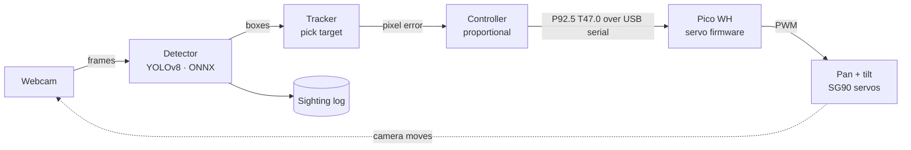

# Skynode

AI sky tracker: YOLOv8 detects aircraft and drones, a Pico-driven pan-tilt camera follows them, and every sighting is logged.

Skynode is layer one of a larger project: sense and track, built toward drone and aerospace systems.

> **Scope:** passive sensing and tracking only. No payloads, no effectors, no radio transmitting or jamming. It never interacts with or interferes with aircraft.

## How it works



1. **Sense.** The brain (a laptop for now, a Raspberry Pi 4 later) grabs webcam frames and runs a YOLOv8 model through ONNX Runtime. The model was trained on ~48,500 aerial images and has three classes: `airplane`, `drone`, `helicopter`.
2. **Track.** It picks one target and measures how far the target sits from the center of the frame, in pixels.
3. **Control.** A proportional controller turns that pixel error into a small pan/tilt correction ("the target is 40 px right, so pan +2°").
4. **Actuate.** The brain sends a plain-text command like `P92.5 T47.0` over USB serial. The Pico moves both servos smoothly, keeps them inside safe angle limits, and the camera re-centers on the target.
5. **Log.** Every sighting is recorded with time, class, confidence, and pan/tilt angle.

Detection, tracking, and control are separate modules, so each layer can be reused on future platforms.

## Repo layout

```
skynode/
├── pico/       MicroPython servo firmware (runs on the Pico WH)
├── brain/      detection, tracking, control, logging (runs on laptop / Pi 4)
├── docs/       wiring diagrams, photos, demo GIFs
├── hardware/   3D-print files for the pan-tilt bracket
└── tests/      laptop-side tests: python -m unittest discover tests
```

## Model

The trained ONNX model is **not** in git (`*.onnx` and `*.pt` are gitignored). It will be attached to a [GitHub Release](https://github.com/bsalsa2/Skynode/releases); download it from there.

## Hardware

| Part | Notes |
|---|---|
| Raspberry Pi Pico WH | servo controller, flashed with MicroPython |
| 2× SG90 micro servo | pan (GP0) and tilt (GP1) |
| Breadboard + jumpers | |
| 470–1000 µF electrolytic capacitor, ≥10 V | across the servo power rails, about $0.20 |
| Webcam | laptop built-in or USB |

## Wiring

SG90 wire colors: **brown = GND**, **red = +5 V**, **orange = signal**.

```
                    ┌──── USB to laptop ────┐
  pan signal  ── 1  │ GP0              VBUS │ 40 ──► + rail (5 V)
  tilt signal ── 2  │ GP1              VSYS │ 39
  − rail      ── 3  │ GND              GND  │ 38
                    │  Raspberry Pi Pico WH │
                    └───────────────────────┘

  + rail (5 V) ──┬── red   (pan servo)
                 ├── red   (tilt servo)
                 └── capacitor + leg
  − rail (GND) ──┬── brown (pan servo)
                 ├── brown (tilt servo)
                 ├── capacitor − leg (the striped side)
                 └── Pico pin 3 (GND)
```

| From | To |
|---|---|
| Pico pin 40 (VBUS, 5 V from USB) | breadboard + rail |
| Pico pin 3 (GND) | breadboard − rail |
| Pan servo orange | Pico pin 1 (GP0) |
| Tilt servo orange | Pico pin 2 (GP1) |
| Both servo reds | + rail |
| Both servo browns | − rail |
| Capacitor | across + and − rails, stripe to − |

**Power notes**

- Power the servos from **VBUS (5 V)**, never from the 3V3 pin. SG90s are 5 V parts, and a stalling servo on 3V3 can brown out the Pico's own regulator. The 3.3 V signal from GP0/GP1 is fine for SG90s.
- **Budget:** a laptop USB 2.0 port supplies about 500 mA. One SG90 draws about 10 mA idle, 100–250 mA moving, and up to about 650 mA stalled. Two servos hitting their end stops at once can pull the 5 V line down and reset the Pico. The symptom is the USB connection dropping and coming back. The capacitor covers the short spikes, and the firmware's speed limit keeps them small.
- **Upgrade path:** if resets persist, power the servos from a separate 5 V ≥2 A supply (an old phone charger plus a USB breakout works). Tie its GND to the Pico's GND.

## Getting started

1. **Pico firmware:** flash, test, and calibrate the servos. See [`pico/README.md`](pico/README.md).
2. **Brain:** coming next. See [`brain/README.md`](brain/README.md).

## Roadmap

- [ ] Pico servo firmware
- [ ] Detection + tracking loop
- [ ] Sighting logger
- [ ] Live dashboard
- [ ] Pi 4 + solar deployment

## License

MIT, see [LICENSE](LICENSE).
